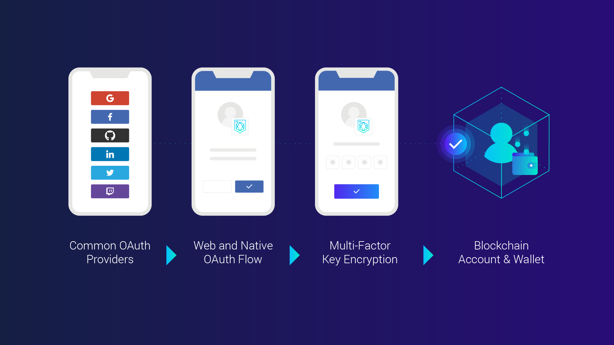

<script async defer src="https://buttons.github.io/buttons.js"></script>

# ORE ID - Authentication for Blockchain


ORE ID allows you to add blockchain to your app. Users can login with one-click sign-up and blockchain account creation. ORE ID supports Apple, Google, Facebook, Github, Linkedin, Twitter, Twitch, Email, Phone, and practically any other OAuth-enabled login provider.

With ORE ID, users of your web or mobile app get an on-chain account upon first sign-in. Their private key is encrypted with a PIN (or Password) of their choosing and stored for them so they don't have to remember their blockchain accounts or keys.

ORE ID also serves as a blockchain wallet for your users. Your app can request a user to sign a transaction using their password to decrypt their keys.

ORE ID is the easiest way for you to add support blockchain wallet support to your app. For example, ORE ID supports any Ethereum wallet that support the Web3 (like Metamask) or WalletConnect standards, and other wallet plugins and apps for other chains.

ORE ID removes the friction between your app and your future users. 



# Quick Start Guide

Try it now

<a class="github-button" href="https://githubbox.com/TeamAikon/oreid/tree/master/examples/react/tutorial/step2-sign" data-icon="octicon-play" aria-label="Open in CodeSandbox">Open in CodeSandbox</a>

OR

To run sample code, start with the React examples from our tutorial:

First, clone this repo to your local machine.
```shell
git clone https://github.com/TeamAikon/oreid.git
```

Now, run the first example by entering the following:
```shell
cd examples/react/tutorial/step1-login

yarn (or npm install)
yarn start (or npm run start)

OR

npm install
npm run start
```
    
Continue on with other steps in the tutorial.

# Usage


## To use in your app

### Step 1 - Register your app and logo

Create a developer account [here](https://oreid.io/developer/new-app).

Note your API-Key and APP-ID in the developer dashboard under "settings".

### Step 2 - Install library

For Javascript/Typescript apps, install the npm client module
```shell
npm install oreid-js
```

Import oreid-js in your module:
```typescript
import { OreId } from 'oreid-js';
import { WebPopup } from "oreid-webpopup";
```

Declare the ORE-ID Options
```typescript
const oreIdOptions: OreIdOptions = {
    appName: "My Amazing App",
    appId: "t_fb2b....b6f7",
    plugins: { popup: WebPopup() }
}
```

Initialize the library in your application:
```typescript
const oreId = new oreId(oreIdOptions);
await oreId.init();
```

### Step 3 - Call Login

Call login and specify a provider (facebook, scatter, etc.) 
```typescript
async function loginUser() {
    try {
        await oreId.popup.auth({ provider: 'google' })
        const userData = await oreid.auth.user.getData()
        console.log(`Hello ${userData.name}`)
        console.log(`Your blockchain accounts are: ${userData.chainAccounts}`)
    }
    catch (error) {
        console.error(error)
    }
}
```

 After login, your app will receive the user's blockchain accounts/addresses (that maps to public/private keys).

 
The user's info will automatically be stored in local state (cookie, etc.) and will be restored the next time the user uses your app.

<br>

### Step 4 - Call Sign

When your app needs the user to sign a blockchain transaction, you just specify the chain name (e.g. eth_main) and chain account. 

```typescript
// sign a blockchain transaction
oreId.createTransaction({
    transaction: { from, to, value, ... }, // blockchain transaction (differs by chainNetwork)
    chainAccount: '0x...',
    chainNetwork: 'eth_ropsten',
}).then(transaction => {
    // have the user approve signature
    oreId.popup.sign({ transaction })
    .then({ transactionId } => { ... })
    .catch( onError );
})

```
<br>

If a user has a blockchain wallet (e.g. Metamask) you can call the discover function that will prompt the user to unlock their wallet and request the list of accounts stored in the wallet. Public keys stored in the wallet will be automatically remembered so you can help the user find the right wallet and keys quickly the next time they need to repeat a transaction. Awesome!

### Step 5 - User can view and control account on the blockchain  

User's can review the blockchain account info and transactions they've signed with ORE ID on a block chain explorer. User's can bring thier own accounts stored in wallet apps (e.g. Metamask) or take control of accounts by exporting the accounts and key backups from ORE ID into a wallet app.

<br>

## Proxy Server for Production Apps

If you are building an app that runs entirely in the browser (like a create-react-app app does), you must run a simple proxy server to protect your api-key. When the React app tries to call an ORE ID API endpoint, the proxy server will inject your api-key into the request header.<br>
The [oreid-js](https://www.npmjs.com/package/oreid-js) npm module includes Express middleware that makes it easy to configure your proxy server. 

```javascript
// proxy server middlewear that injects apikeys/secrets into request headers
addOreidExpressMiddleware(expressApp, { apiKey: 'my secret api key' })
```

Take a look at the complete example of using a proxy server [here](https://github.com/TeamAikon/ore-id-docs/tree/master/examples/react/advanced/react-server).

## Example projects

Refer to the examples folder for the following sample projects

- ReactJS - Several ReactJS apps that includes React Login button component

- React Native - A React Native app that includes a React OAuth flow modal component

- Express Server - A simple Express server that includes the use of middleware to automate handling of callbacks
  
- Proxy Server - A complete example using a Proxy Server to run along side an app that runs completely in the browser (like a create-react-app app)

If you are only using one chain in your app, check out examples just for that chain in its own directory. Ex: /examples/_ethereum
